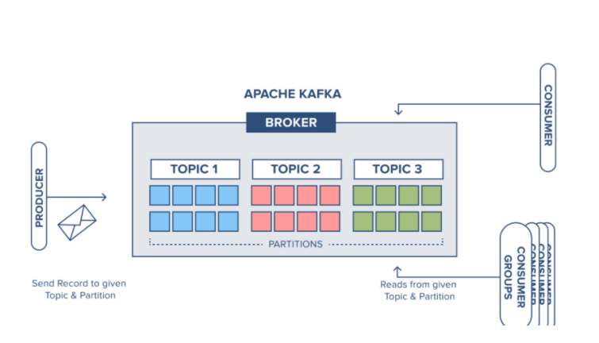
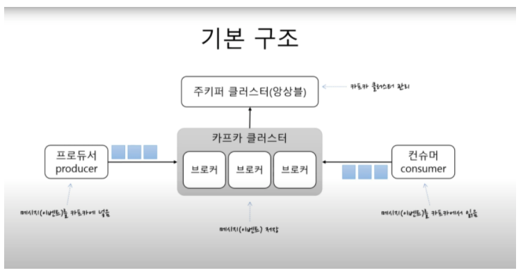

# Spring Boot Kafka Guide

https://spring.io/projects/spring-kafka

https://docs.confluent.io/platform/current/overview.html


***

## 목차

- [Intro](#Intro)

- [Kafka Cluster](#Kafka-Cluster)

- [Kafka Docker Container](#Kafka-Docker-Container)

- [Kafka Cluster 주요 설정](#Kafka-Cluster-주요-설정)

- [Kafka Producer](#Kafka-Producer)

- [Producer 에서 고려할 사항](#Producer-에서-고려할-사항)

- [Kafka Consumer](#Kafka-Consumer)

- [Consumer 에서 고려할 사항](#Consumer-에서-고려할-사항)

***

## Intro 

Spring 에서 Apache Kafka 를 효율적으로 사용하는 방법에 대해 정리한다. 

여기서 Kafka 는 직접 설치하지 않고 도커 컨테이너를 통해 실행시킨다.  

카프카는 기본적으로 메시징 서버로 동작한다. 

메시지라고 불리는 데이터 단위를 보내는 측 Producer 에서 카프카에 토픽이라는 각각의 메시지 저장소에 데이터를 저장하면 
가져가는 측 Consumer 가 원하는 토픽에서 데이터를 가져가게 되어있다. 


*** 





#### Zookeeper Cluster

Zookeeper 는 분산 시스템에서 서비스 동기화와 naming registry 를 위해서 사용한다. 

주로 하는 일은 Apache Kafka Cluster 의 상태를 추적하고 관리하는 역할을 한다. 

이외에도 Zookeeper 는 모든 파티션에서 리더 팔로우 관계를 유지해주는 역할을 하도록 컨트롤러를 선택해주는 역할을 하기도 한다. 

#### Kafka Cluster

Kafka 클러스터는 하나 이상의 Broker 로 구성된다. 주로 하는 역할은 Broker의 Controller 로서 역할을 한다. 

#### Broker 

Producer 로 부터 들어온 메시지를 저장하고 Consumer 가 이 메시지를 topic 별로 각 partition 에서 offset 을 기준으로 fetch 할 수 있도록 한다. 

이중화를 하고 장애에 대응하는 역할도 한다. 

#### Producer 

데이터 스트림을 생산하는 역할을 producer 가 합니다. 토큰 또는 메시지를 생성하고 이를 Kafka 클러스터의 하나 이상의 topic 에 추가로 append 하기 위해 Apache Kafka Producer 를 사용합니다

#### Consumer 

Consumer 는 Consumer Group 에 속해서 topic 을 subscribe 하고 해당 topic 에 있는 partition 에 데이터가 들어있다면 그 데이터를 가지고 오는 역할을 합니다. 


#### Topic 과 partition

카프카에서 Producer 가 보내는 메세지는 topic 으로 분류되고, topic 은 여러개의 파티션으로 나눠 질 수 있다. 

파티션내의 한 칸은 로그라고 불린다. 데이터는 한 칸의 로그에 순차적으로 append 된다. 

메세지의 상대적인 위치를 나타내는게 offset이다. 배열에서의 index를 생각하면 된다. 

***
## Kafka Docker Container 

### Pre-Requisites

- install docker-compose https://docs.docker.com/compose/install/

- modify the KAFKA_ADVERTISED_HOST_NAME in docker-compose.yml to match your docker host IP (Note: Do not use localhost or 127.0.0.1 as the host ip if you want to run multiple brokers.)

- if you want to customize any Kafka parameters, simply add them as environment variables in docker-compose.yml, e.g. in order to increase the message.max.bytes parameter set the environment to KAFKA_MESSAGE_MAX_BYTES: 2000000. To turn off automatic topic creation set KAFKA_AUTO_CREATE_TOPICS_ENABLE: 'false'

### Usage 

##### Start a cluster: 
```
$ docker compose up -d 
```

##### Destroy a cluster:
```
$ docker compose down 
```

##### Run a command to access  a running container
      
```
$ docker exec -it kafka bash 
```

***

### Kafka Shell Script 

Container 에 접속 후 /opt/kafka/bin 경로에 카프카 shell script 있음 (wurstmeister/kafka 이미지 기준)

- **kafka-topics.sh**
  - 토픽 생성, 조회, 수정 등 역할
  - 토픽 생성 
    - ./kafka-topics.sh --create --bootstrap-server localhost:9092 --replication-factor 1 --partitions 1 --topic [TOPIC_NAME]
  - 토픽 조회 
    - 카프카 클러스터를 만들 때 기본 값으로 쓰면 /tmp/kafka-logs 에 저장되는데 이는 임시 저장소라서 사라질 수 있다. 그러므로 log directory를 바꿔줘야 한다. 나 같은 경우는 /kafka/logs로 바꿨다. 
    - cd /kafka/logs 
- **kafka-console-consumer.sh**
  - 토픽의 레코드 즉시 조회
    - ./kafka-console-consumer.sh --bootstrap-server localhost:9092 --topic test --from-beginning
- **kafka-console-producer.sh**
  - 토픽의 레코드를 전달(String)
    - /kafka-console-producer.sh --bootstrap-server [HOST_NAME]:9092 --topic [TOPIC_NAME]
- **kafka-consumer-groups.sh**
  - 컨슈머그룹 조회, 컨슈머 오프셋 확인, 수정
  - 전체 그룹 조회
    -  ./kafka-consumer-groups.sh --bootstrap-server localhost:9092 --list
  -  특정 그룹 디테일 조회 
- __server.properties__ 
  - kafka cluster 설정을 보는 것 
  - cd /opt/kafka/config/server.properties

***

### Kafka Broker 파티션에 데이터 저장

브로커에선 파티션 하나에 대한 데이터를 한 파일에다가 저장하는게 아니라 `segment`  로 나눠서 저장을 한다. 

`segment` 파일은 `*.index` `*.timeIndex` `*.log` `*.snapshot` 과 같이 있다. 

`*.log` 파일에 실제로 데이터가 저장이 된다. 그리고 오프셋을 검색하기 위한 데이터가 `*.index` `*.timeIndex` 이런 파일이 있는 것

`*.timeIndex` 파일에는 `*.index` 파일에다가 저장 시간이 기록된 거. 

`*.index` 피일에는 `offset` 과 `position` 정보가 들어간다. 

***

  
## Kafka Cluster 주요 설정

카프카의 기본 옵션 중 일부만 미리 변경해서 사용한다면 카프카 운영을 보다 안정적으로 사용할 수 있다. 

이 설정들에 대해 조금 알아보자 

#### log.retention.hours=72

retention 옵션을 기본값으로 사용한다면 나중에 디스크가 다차는 문제가 발생할 수 있다.

이 옵션이 가지는 의미는 카프카에서 토픽으로 저장되는 모든 메시지를 해당 시간만큼 보관하겠다는 의미다.

기본값이 168시간으로 7일을 의미하는데 예제를 위해 계산하기 쉽게 메시지 하나가 1KB라고 가정하고 10,000/sec의 메시지가 카프카로 유입된다고 가정하고 마지막으로 7일을 보관하겠다고 계산을 해보면 다음과 같다.

1KB * 10,000(초당 메시지 수) * 60(1분) * 60(1시간) * 24(1일) * 7(일) * N(레플리카 수) * T(토픽의 수)

여기서 레플리카 수를 3이라 하고 메시지 토픽이 10개 있다고 가정해서 계산을 해보면 168TB라는 숫자가 나오게 된다.

하지만 retention 숫자를 168이 아닌 72로 바꾼다면 즉 3일로 바꾼다면 168TB도 72TB로 바뀌게 된다. 필요로 하는 디스크 공간을 많이 줄일 수 있다.

대부분 많은 카프카에 있는 메시지를 실시간으로 가져가고 있기 때문에 7일이나 보관한다는 의미는 필수적이라고 생각하지는 않는다.

retention 시간 값을 정확히 72로 고정시킨 이유는 일의 라이프 스타일을 고려해서 결정된 값이다. 주말에 장애가 나더라도 이 로그는 월요일까지 살아있을 것이다.

그래서 72라는 값을 추천하는 것이니 카프카를 사용하기 전에 해당 옵션에 대해 한번 고민해보는 걸 추천한다.

#### delete.topic.enable=true

이 옵션은 카프카의 토픽 삭제와 관련된 옵션이다. 만약 허용하지 않는다면 삭제를 하더라도 삭제되지 않고 삭제 표시만 남아 있게 된다.

예를 들면 만약 위의 경우처럼 디스크가 가득 차서 토픽을 삭제해야 하는데 해당 옵션이 적용되어 있지 않다면 토픽을 삭제할 수 없는 상황이 발생하게 된다.

그러므로 해당 옵션을 확인해서 토픽을 삭제할 수 있도록 변경하는 걸 추천한다. 내가 필요할 때 언제든 토픽을 삭제할 수 있도록.

#### allow.auto.create.topics=false

이 옵션은 토픽 자동생성과 관련된 옵션이다. 토픽 메시지를 Producer가 보내기 전에 토픽을 미리 카프카에 만들어놔야 하는데 만약 관리자가 실수로 카프카에 토픽을 미리 생성하지 않은 상태라면 이 옵션이 true로 설정되어 있다면 자동으로 토픽을 생성해주는 기능이다.

되게 편리해 보이는 기능인데 경우에 따라선 매우 좋지 않은 기능이기도 하다.

분명 필요하지 않은 토픽이라 생각해 지웠는데 어디선가 자꾸 토픽이 생겨나기도 해서 관리자가 알지도 못하는 토픽이 자꾸 발생하는 문제가 일어나기도 한다.

그러므로 이 옵션은 false로 사용하기를 권장한다.

#### log.dirs=/data

해당 옵션은 각 토픽들의 메시지들이 저장되는 실제 경로를 말한다. 최근 서버들을 보면 OS 영역은 용량이 적은 정도의 디스크로 사용하고 데이터 디렉토리를 별도의 용량이 큰 디스크를 사용하기도 한다.

하지만 이 옵션을 통해 용량이 큰 별도의 디스크 경로로 설정해주지 않는다면 기본값이 /tmp/kafka-logs로 설정되어 있어서 OS 영역의 디스크를 사요하게 되고 결국 용량이 가득차는 경우가 발생할 수 있다.

해당 옵션을 확인해 미리 설정한다면 이런 장애 상황을 방지할 수 있다.

***

## Kafka Producer 

Producer 는 메세지를 생산하는 주체이다. 메세지를 만들고 Topic 에 메세지를 쓴다. 

특정 메세지들을 분류해서 특정 파티션에 저장하고 싶다면, key 값을 통해서 분류해서 넣을 수 있다. 

Kafka Producer 노드의 구조에는 `Accumulator` 와 `Network Thread` 를 가지고 있다.

`Accumulator` 는 메시지를 브로커에 있는 파티션에게 보내기 위한 큐라고 생각하면 되고 `Network Thread` 는 파티션에게 보내주는 역할을
하는 스레드라고 생각하면 된다. 
 
`Accumulator` 는 데이터를 `broker`에 보내는 `send()` 메소드를 호출할 때 레코드를 메모리에 쌓아두는 역할을 한다

`Accumulator` 에는 토픽 파티션마다 레코드들을 쌓을 수 있는 공간이 있다. 이걸 `RecordBatch` 라고 하며  `record` 를 총 쌓을 수 있는 공간이  `buffer.memory` 이다. 

`Network Thread` 는 `Accumulator` 에 쌓인 `RecordBatch` 를 `Broker` 에 전달해주는 역할을 한다. 즉 레코드 한 건마다 보내는게 아니라 배치 작업을 한다. 
`batch.size` 옵션을 통해 `RecordBatch` 사이즈를 결정한다.
 
`batch.num.messages` 를 사용하여 각 배치에 포함된 메시지 수에 대한 제한을 설정하는 것도 가능하다.

Spring 에서 Kafka 를 이용해서 데이터를 보낼 땐 `KafkaTemplate` 을 이용해서 보내면 된다.

추상화를 잘 해놔서 데이터를 보낼 때 동기식으로 보낼지 비동기식으로 보낼지 결정하지 않아도 된다.  

`KafkaTemplate` 에서는 데이터를 보낸 후 성공적으로 보냈는지 결과를 받을 수 있는데 `ListenableFuture` 의 결과로 받을 수 있다. 

***

## Producer 에서 고려할 사항 

#### Blocking

Blocking 이슈는 내가 `Network Thread` 로 계속해서 메시지를 브로커에 보내는 수 보다 `Accumulator` 에 쌓는 속도가 더 빠르다면 블록킹 될 수 있는 이슈가 있다. 

이때 블락이 된다면 `max.block.ms` 만큼 가다리고 그래도 블락이라면 프로듀서는 `Exception` 을 던지게 된다. 

하지만 `block.on.buffer.full=false` 설정을 통해서 애초에 버퍼가 다 차게 된다면 바로 `Exception` 을 던지게 할 수 있다. 

이런 `Exception` 을 받아서 따로 처리할 수 있는 로직에 대해서는 좀 더 리서치가 필요하다. 

그리고 `request.timeout.ms` 시간 설정을 통해서 메시지가 Accumulator 에 무기한 대기 하지 않도록 한다. 저 시간동안 
메시지가 보내지지 않으면 대기열에서 제외되고 예외가 발생한다.     


#### Batching and Compression
 
`linger.ms` 설정을 통해서 `Network Thread` 가 보내는 주기를 조정할 수 있다. 그 시간동안 `RecordBatch` 에 데이터가 쌓이는 시간을 벌 수 있다. 
 
하나하나씩 데이터를 보내는게 아니라 `max.request.size` 만큼의 크기를 한 번에 `Network Thread` 가 보낼 수 있다. 

Compression 은 `compression.type`에 따라 활성화 할 수 있다. 압축은 배치가 클수록 효율이 높다.

그리고 snappy 압축을 사용할려면 /tmp 디렉토리에 대한 쓰기 엑세스 권한이 필요하다.


#### Message Ordering

일반적으로 브로커에 메시지가 쌓이는 순서는 Producer 가 메시지 보내는 순서와 같다. 

하지만 메시지가 네트워크 상에 유실이되서 다시 재전송을 해야한다면 메시지 순서가 바뀔 수 있다. 

만약 재전송을 하는데 데이터 순서를 보장하고싶다면 max.in.flight.request.per.connection 설정을 1로 하면 된다. 

이 값은 블로킹 없이 한 커넥션에서 전송할 수 있는 최대 전송중인 요청 개수를 말한다. 즉 브로커로부터 `Ack` 를 받지 않고 한번에 `Network Thread` 로 보낼 수 있는 개수를 말한다.  


#### Message Loss 

마지막으로 메시지 손실에 대한 고가용성 설정을 `Acks`를 통헤 Producer 에서 할 수 있다.
  
acks는 acknowledgments의 약자로 사전에서 찾아 보면 "승인"이라는 뜻을 가지고 있는데, 여기에서 개념을 이해하기 위해 "확인"이라는 뜻으로 이해하면 좋을 것 같다.
 
프로듀서가 사용하는 acks 옵션은 간단하게 말해 프로듀서가 메시지를 보내고 그 메시지를 카프카가 잘 받았는지 확인을 할 것인지 또는 확인을 하지 않을 것인지를 결정하는 옵션이다.

|     Option     | Message Loss | Speed |                         Description                          |
| :------------: | :----------: | :---: | :----------------------------------------------------------: |
|    acks = 0    |      상      |  상   | Producer는 자신이 보낸 메시지에 대해 카프카의 확인을 기다리지 않는다. |
|    acks = 1    |      중      |  중   | Producer는 자신이 보낸 메시지에 대해서 카프카의 leader가 메시지를 받았는지만 기다린다. |
| acks = all(-1) |      하      |  하   | Producer는 자신이 보낸 메시지에 대해 카프카의 leader와 follower까지 받았는지 기다린다. 최소 하나의 복제본까지 처리된 것을 확인하므로 메시지가 손실될 확률은 거의 업삳. |

   
#### References:
- https://kafka.apache.org/090/javadoc/org/apache/kafka/clients/producer/ProducerConfig.html
- https://kafka.apache.org/090/javadoc/index.html?org/apache/kafka/clients/producer/KafkaProducer.html
- https://www.popit.kr/kafka-%EC%9A%B4%EC%98%81%EC%9E%90%EA%B0%80-%EB%A7%90%ED%95%98%EB%8A%94-producer-acks/

***

## Kafka Consumer 
Consumer 는 소비자로써 메세지를 소비하는 주체이다. 해당 topic 을 구독함으로써, 자기가 처리할 수 있는량을 스스로 조절해가면서 소비할 수 있다. 

소비를 했다는 표시는 해당 topic 내의 각 파티션에 존재하는 offset 의 위치를 통해서 이전에 소비했던 offset 위치를 기억하고 관리한다. 

이를 통해서, 혹시나 Consumer 가 죽었다가 다시 살아나도, 전에 마지막으로 읽었던 위치에서 부터 다시 읽어들일 수 있다.

Consumer 는 Consumer Group 에 항상 속하고 같은 그룹에 있는 Consumer 는 파티션을 공유하지 않는다. 그러므로 Consumer 수가 Partition 수보다 많으면 
놀고있는 Consumer 가 있다는 뜻이다. 

Consumer 의 내부에는 `fetcher` 와 `Coordinator` 가 있다.
 
`fetcher` 는 사용자가 `poll()` 함수를 호출해 내부에 있는 레코드를 요청하고 레코드가 없다면 `Broker` 로 요청해 레코드를 가지고 오는 역할을 한다. 

`coordinator` 는 어떤 토픽과 파티션을 가지고 올 지 `Broker` 와 통신하는 역할을 한다. 

`max.poll.records` 로 `poll()` 메소드를 실행시켰을 때 가지고올 수 있는 최대 레코드 수를 결정할 수 있다. 

***

## Consumer 에서 고려할 사항 

#### Rebalancing 

Consumer 에선 리밸런스가 일어날 수 있는 이슈에 대해서 알아야 한다. 

`session.timeout.ms` 설정동안 Consumer가 Broker에게 하트비트를 날리지 않는다면 Consumer가 죽은 줄 알고 리밸런싱을 한다 

이떄 화트비트를 보내는 시간은 `heartbeat.interval.ms` 시간이다. 이 시간의 값은 `session.timeout.ms` 의 1/3 보다 크면 안된다고 한다.

`max.poll.interval.ms` 설정동안 컨슈머가 브로커에게 값을 가져가지 않는다면 이때도 리밸런싱을 한다. 

#### Performance  

`max.partition.fetch.bytes` 설정으로 하나의 토픽 파티션에서 가지고 올 수 있는 레코드 최대 크기를 설정할 수 있다. 

`fetch.min.bytes` 브로커에서 레코드를 가지고 올 수 있는 최소한의 크기를 설정할 수 있다. 

`fetch.max.wait.ms` 설정으로 브로커에서 메시지가 쌓일 때까지 기다리는 시간을 설정할 수 있다.

마지막으로 Consumer 의 수가 토픽 파티션의 수보다 많으면 놀고 있는 컨슈머가 생길 수 있다. 

#### Commit 

KafkaConsumer 는 `thread-safe` 하지 않다. 이 말은 오프셋과 관련있는데 `내가 어디까지 데이터를 읽었지?` 라는 기록에 대한 것이다. 

이런 상태는 `Consumer` 끼리 공유할 수 있으므로 Consumer 는 안전하게 멀티 스레드 환경에서의 프로그래밍을 해줘야 한다.
 
일반적으로 카프카에서 오프셋을 관리할 때 `enable.auto.commit=true` 를 설정하면 자동으로 커밋을 한다. 이 경우 `auto.commit.interval.ms` 이 시간 간격동안 자동으로 커밋을 한다.
 
하지만 만약에 자동으로 커밋을 하기전에 컨슈머가 죽는다면 커밋을 하지않고 죽었기 떄문에 데이터가 중복으로 읽는 문제가 생길 수 있다. 그래서 기본적으로 조금 더 느리더라도 데이터를 읽고나서 모두 해당 데이터를 처리 한 다음에 커밋을 하도록 하는 수동 커밋을 해야한다. 

근데 이런 수동 커밋에서도 문제가 발생할 수 있다. 내가 데이터를 100번까지 읽었는데 50번까지 처리를 했다. 하지만 설정에 따라 아직 커밋을 하지 않았을 수 있다.(기본적으로는 다음 `poll()` 메소드를 호출하기 전에 커밋을 하기 떄문에) 

즉 데이터 100번을 모두 처리해야 커밋을 할 수 있다. 근데 이때 컨슈머가 죽는다면 커밋을 하지 않는 문제가 생긴다. 

그래서 이 문제를 해결하기 위해서 하나하나 레코드에 대한 처리 후 커밋을 하도록 바꿀 수 있지만 이러면 너무 느려지는 문제가 생긴다. 

이를 해결하기 위해서는 프로세스가 죽을 때 `graceful Shutdown` 을 지원하도록 하고 `SIGTERM` 시그널이 오면 `나 이제 요청은 안받는데 죽기전에 나 여기까지 작업 마무리하고 커밋하고 죽을게`를 섫정할 수 있다.    

근데 이런 멀티스레드 작업을 스프링 카프카에서는 안해도 된다. `@KafkaListener` 이 에노테이션 설정만 해놓으면 `KafkaMessageListenerContainer` 의 `doPoll()`, `doStop()` 메소드들이 알아서 다 처리해준다. 

우리가 신경쓸 껀 컨슈머의 개수와 파티션의 개수 그리고 각 Consumer의 설정만 해주면 된다. 

그리고 스프링에서는 `sever.shutdown=graceful` 속성으로 `graceful shutdown` 을 지원할 수 있다.
  

#### References: 
- https://kafka.apache.org/090/javadoc/org/apache/kafka/clients/consumer/ConsumerConfig.html
- https://kafka.apache.org/090/javadoc/org/apache/kafka/clients/consumer/KafkaConsumer.html
- https://docs.confluent.io/3.0.0/clients/consumer.html#synchronous-commits
